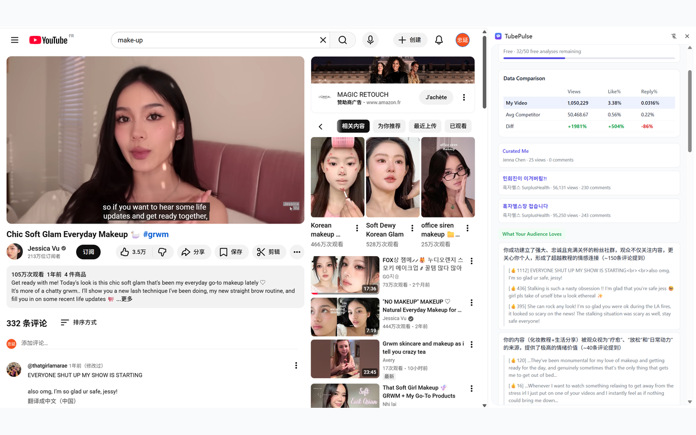
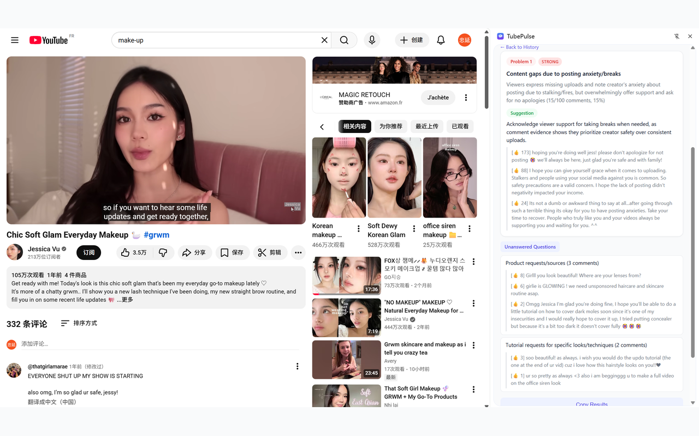
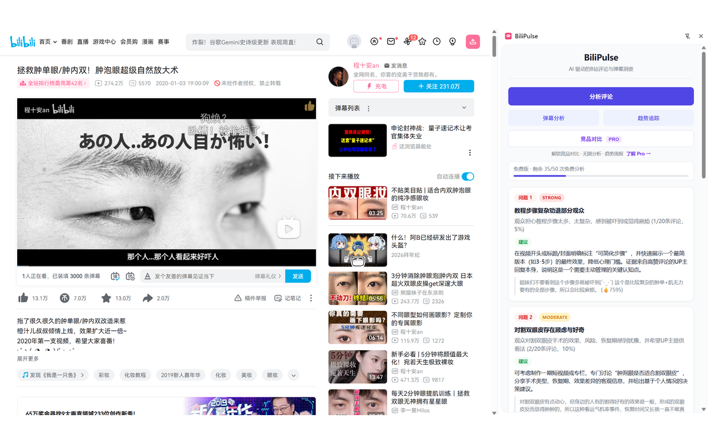

# CommentPulse

AI-powered comment analysis for content creators. Stop guessing what your audience wants — let data tell you.

CommentPulse reads hundreds of comments on your videos, quantifies recurring problems, and gives you specific, evidence-based suggestions to improve your content.

## Plugins

| Plugin | Platform | Directory | Install |
|--------|----------|-----------|---------|
| **TubePulse** | YouTube | `TubePulse/` | [Chrome Web Store](https://chromewebstore.google.com) |
| **BiliPulse** | Bilibili | `BiliPulse-ext/` | [Chrome Web Store](https://chromewebstore.google.com) |

## Screenshots

### TubePulse — YouTube Comment Analysis

| Comment Analysis | Problem Details |
|:---:|:---:|
|  |  |

### BiliPulse — B站评论 & 弹幕分析

| 评论分析 | 弹幕分析 |
|:---:|:---:|
|  |  |

## Features

### Comment Analysis (Free)

Open any video, click **Analyze Comments**, and get:

- **Quantified problems** — Each issue shows how many comments mention it (e.g., "15/100 comments, 15%") with signal strength (strong/moderate/weak)
- **Evidence-based suggestions** — Every suggestion links back to real viewer comments with like counts
- **Unanswered questions** — Topics viewers keep asking about that you haven't addressed

### Danmaku Analysis (BiliPulse only, Free)

Analyze bullet comments (弹幕) to find:

- Engagement peaks and drop-off points by timestamp
- Recurring viewer reactions at specific moments
- Content segments that generate the most discussion

### Niche Insights (Pro)

Compare your video against competitors in the same niche:

- Auto-discovers similar videos via AI keyword extraction
- Side-by-side data comparison (views, like rate, comment rate)
- Strengths, weaknesses, opportunities from comment analysis
- Specific action items backed by competitor comment evidence

### Trend Tracking (Free)

Track how viewer feedback evolves across your videos:

- Problem history across multiple videos on the same channel
- See which issues persist and which were resolved

### Improvement Comparison (Free)

Compare two videos from the same channel to see:

- Which problems were fixed
- Which problems persist
- What new issues appeared

## Architecture

```
┌─────────────────┐     ┌──────────────────┐     ┌─────────────┐
│  Chrome Extension │────▶│  Backend Worker   │────▶│  AI Provider │
│  (this repo)     │     │  (private)        │     │  (DeepSeek)  │
│                  │     │                   │     └─────────────┘
│  - popup.js      │     │  - Comment fetch  │
│  - content.js    │     │  - AI analysis    │     ┌─────────────┐
│  - config.js     │     │  - Usage tracking │────▶│  Platform API│
└─────────────────┘     │  - Rate limiting  │     │  (YT / Bili) │
                         └──────────────────┘     └─────────────┘
```

The extension client is open source. The backend worker that handles API calls, AI processing, and usage management is private.

## Open-Core Model

This project follows an **open-core** model:

| Component | Status | Details |
|-----------|--------|---------|
| Extension client code | Open source (Apache-2.0) | Full UI, DOM extraction, history management |
| Backend worker | Private | API proxying, AI prompts, billing, rate limiting |
| Production secrets | Private | API keys, KV namespace IDs |

Self-hosting is fully supported. You can deploy your own backend and point the extension to it via `config.js`.

See `OPEN_SOURCE_SCOPE.md` for the full breakdown.

## Self-Hosting

### Quick Start

1. **Clone this repo**
   ```bash
   git clone https://github.com/xiezhongyan2015-debug/commentpulse.git
   cd commentpulse
   ```

2. **Choose a plugin** — `TubePulse/` (YouTube) or `BiliPulse-ext/` (Bilibili)

3. **Configure the backend endpoint**
   ```bash
   cd TubePulse  # or BiliPulse-ext
   cp config.example.js config.js
   ```
   Edit `config.js` and set `API_BASE_URL` to your own backend:
   ```js
   window.APP_CONFIG = Object.freeze({
     API_BASE_URL: "https://your-api.example.com",
     OFFICIAL_SITE_URL: "https://your-site.example.com",
     BRAND_NAME: "TubePulse",
     MODE: "selfhost",
   });
   ```

4. **Update manifest.json** — Add your backend URL to `host_permissions`:
   ```json
   "host_permissions": [
     "https://your-api.example.com/*"
   ]
   ```

5. **Load the extension**
   - Open `chrome://extensions`
   - Enable "Developer mode"
   - Click "Load unpacked" and select the plugin directory

### Backend API Contract

Your backend needs to implement these endpoints:

| Method | Path | Description |
|--------|------|-------------|
| `POST` | `/analyze` | Analyze video comments. Body: `{ videoId, title, channel, views, published, likes, duration }` |
| `POST` | `/competitor` | Compare against competitor videos. Body: `{ videoId, title }` |
| `POST` | `/improvement` | Compare two videos. Body: `{ videoId, channel }` |
| `GET` | `/usage` | Get usage quota info. Header: `X-User-Id` |
| `GET` | `/entitlements` | Get feature entitlements. Header: `X-User-Id` |
| `GET` | `/trend` | Get trend snapshots. Header: `X-User-Id` |
| `DELETE` | `/trend` | Clear trend data. Header: `X-User-Id` |
| `POST` | `/waitlist` | Submit waitlist email. Body: `{ email }` |
| `POST` | `/trial/start` | Activate trial. Header: `X-User-Id` |

BiliPulse additionally requires:

| Method | Path | Description |
|--------|------|-------------|
| `POST` | `/danmaku` | Analyze bullet comments |

### Config Fields

| Field | Description |
|-------|-------------|
| `API_BASE_URL` | Your backend API endpoint |
| `OFFICIAL_SITE_URL` | Your site URL (for links in the UI) |
| `BRAND_NAME` | Display name shown in the extension |
| `MODE` | `selfhost` or `official` |

## Project Structure

```
commentpulse/
├── TubePulse/                 # YouTube plugin
│   ├── manifest.json          # Chrome extension manifest (MV3)
│   ├── background.js          # Service worker
│   ├── content.js             # YouTube page DOM extraction
│   ├── popup.html/js/css      # Extension UI
│   ├── config.js              # Runtime config (API endpoint)
│   ├── config.example.js      # Config template for self-hosting
│   ├── privacy-policy.html    # Privacy policy
│   ├── landing/               # Landing page
│   ├── icons/                 # Extension icons
│   └── pictures/              # Store screenshots
├── BiliPulse-ext/             # Bilibili plugin
│   ├── manifest.json
│   ├── background.js
│   ├── content.js             # Bilibili page DOM + danmaku extraction
│   ├── popup.html/js/css
│   ├── config.js / config.example.js
│   ├── privacy-policy.html
│   ├── icons/
│   └── pictures/
├── LICENSE                    # Apache-2.0
├── SECURITY.md                # Security policy
├── TRADEMARK.md               # Trademark notice
├── OPEN_SOURCE_SCOPE.md       # What's open vs private
└── CONTRIBUTING.md            # Contribution guide
```

## Tech Stack

| Component | Technology |
|-----------|-----------|
| Extension framework | Chrome Extension Manifest V3 |
| Frontend | Vanilla JS (no framework), CSS |
| Side panel | Chrome Side Panel API |
| Storage (client) | `chrome.storage.local` |
| AI provider | DeepSeek API (configurable) |
| Data sources | YouTube Data API v3 / Bilibili API |

## Security

If you discover a security vulnerability, **do not open a public issue**. Report privately to `xiezhongyan2015@gmail.com`.

See `SECURITY.md` for details.

## Contributing

We welcome contributions! See `CONTRIBUTING.md` for guidelines.

## License

This project is licensed under the **Apache License 2.0** — see `LICENSE` for details.

Brand names (TubePulse, BiliPulse, CommentPulse) and logos are trademarked. If you publish a fork, please use a distinct name and branding. See `TRADEMARK.md`.
